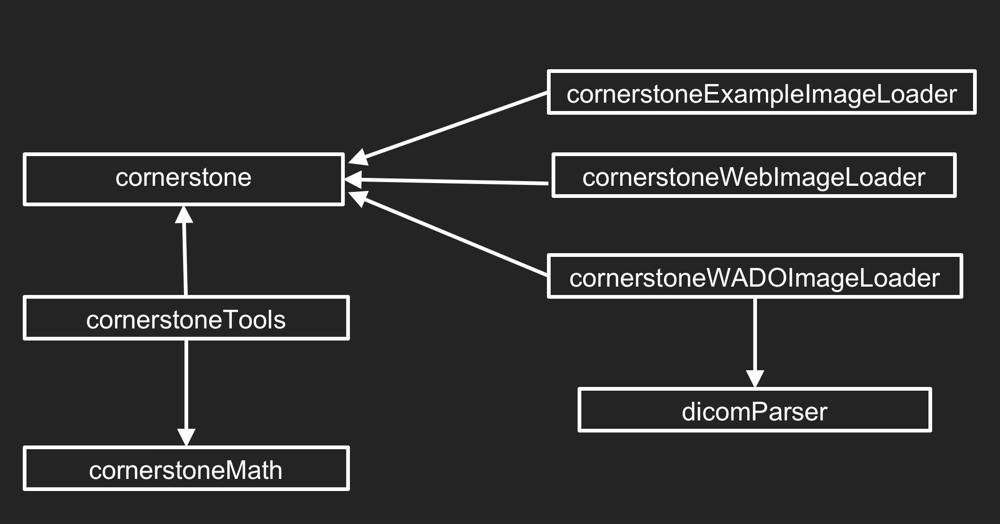

# Cornerstone使用

安装vscode插件Live Server

在线链接引入

```
<script src="https://unpkg.com/cornerstone-core@2.6.1/dist/cornerstone.js"></script>
<script src="https://unpkg.com/cornerstone-math@0.1.10/dist/cornerstoneMath.min.js"></script>
<script src="https://unpkg.com/cornerstone-wado-image-loader@4.13.2/dist/cornerstoneWADOImageLoader.bundle.min.js"></script>
<script src="https://unpkg.com/cornerstone-web-image-loader@2.1.1/dist/cornerstoneWebImageLoader.min.js"></script>
<script src="https://unpkg.com/cornerstone-tools@6.0.10/dist/cornerstoneTools.js"></script>
<script src="https://unpkg.com/dicom-parser@1.8.21/dist/dicomParser.min.js"></script>
```

vscode中右键写好的测试文件，选择Open With Live Server，就能启动一个本地服务器

浏览器中输入http://localhost:5500/即可使用


参考教程https://blog.csdn.net/hdfjkgfmnhbg/article/details/143770729


# 什么是Cornerstone

是一个轻量级JS库，用于提供基于Web的医学成像平台。

cornerstone文档https://docs.cornerstonejs.org/


# 概念

**Enabled Element（启用的元素）**是一个 HTMLElement（通常是 div），我们在其中显示交互式医学图像。


**Image ID（图像ID）**是一个 URL，用于标识 Cornerstone 要显示的单个图像。


**Image Loader（图像加载器）**是一个 JavaScript 函数，负责获取图像的图像ID，并将该图像的相应**图像加载对象**返回给 Cornerstone。


每个 Enabled Element 都有一个 **Viewport（视区）**，用于描述如何渲染图像。


**Image（图像）**是一个图像对象。


**Pixel Coordinate System（像素坐标系）**支持亚像素精度，例如

- (0.0, 0.0)表示左上角像素的左上角
- (0.5, 0.5)表示左上角像素的中心
- (列数, 行数)表示右下角像素的右下角


**Rendering Loop（渲染循环）**使用RAF（requestAnimationFrame）方法，如果 RAF 不可用，则使用`setTimeout` 和 `clearTimeout` 用 16 ms 计时器填充它。

- RAF：是浏览器全局对象window的一个方法。`window.requestAnimationFrame(callback)` 告诉浏览器——你希望执行一个动画，并且要求浏览器在下次重绘之前调用指定的回调函数更新动画。该方法需要传入一个回调函数 `callback` 作为参数，该回调函数会在浏览器下一次重绘之前执行。该回调函数会被传入`DOMHighResTimeStamp`参数，该参数与`performance.now()`的返回值相同，它表示`requestAnimationFrame()`开始去执行回调函数的时刻。能够保证我们的动画函数的每一次调用都对应着一次屏幕重绘，从而避免`setTimeout`通过时间定义动画频率，与屏幕刷新频率不一致导致的丢帧。
- 工作流程
  - 每个 Enabled Element 用它的 `draw()` 函数注册一个RAF循环
  - `draw()` 函数会在一帧显示在屏幕上**之后**被浏览器调用（原文为draw() is called by the browser just **after** a frame is displayed on screen，而RAF是在浏览器在下次重绘**之前**调用指定的回调函数，why？）
  - 一旦被调用：
    - 如果元素计划被重新渲染，则会进行渲染，并且回调函数再次通过RAF注册
    - 如果元素没有计划被重新渲染，则不会执行任何操作，并且回调函数再次通过RAF注册
    - 如果元素被禁用，则不会重新注册回调函数，从而结束渲染循环


**Libraries**



| Library                                                      | Description                                                  |
| ------------------------------------------------------------ | ------------------------------------------------------------ |
| [Cornerstone Core](https://github.com/cornerstonejs/cornerstone) | Central library providing image rendering, loading, caching, and viewport transformations |
| [Cornerstone Tools](https://github.com/cornerstonejs/cornerstoneTools) | Extensible support for building tools, support for mouse, keyboard, and touch devices |
| [Cornerstone WADO Image Loader](https://github.com/cornerstonejs/cornerstoneWADOImageLoader) | Image Loader for DICOM Part 10 files                         |
| [Cornerstone Web Image Loader](https://github.com/cornerstonejs/cornerstoneWebImageLoader) | Image Loader for Web Image files (PNG, JPEG)                 |
| [Cornerstone Math](https://github.com/cornerstonejs/cornerstoneMath) | Mathematical utility functions and classes to support tool development |
| [dicomParser](https://github.com/cornerstonejs/dicomParser)  | Robust DICOM Part 10 parsing library                         |


 **Metadata Providers（元数据提供程序）**是一个 JavaScript 函数，用作访问与 Cornerstone 中的图像相关的元数据的接口。用户可以定义自己的提供程序函数，以便为每个特定图像返回他们希望的任何元数据。


# 高级

**Image Cache（图像缓存）**用于存储图像对象。


 **Enabled Element Layers（启用的元素层）**用于构建复合图像。每个 Enabled Element 可以有多个 Layer，每个 Layer 都有自己的 Image、Viewport、Canvas 等，具有可见性和不透明度属性，并由 Layer ID 唯一引用。同一时间只能有一个 Layer 处于活动状态，Enabled Element 的 Image 和 Viewport 是 active layer 的 Image 和 Viewport。


Lookup Table 用于将原始图像数据（即存储的像素值）转换为适合显示的像素值。

**Modality Lookup Table（模态LUT）**用于将特定模态（如 CT、MRI、X光等）的原始图像数据转换为更通用的表示形式。

**Value of Interest LUT（VOI LUT）**用于根据用户的兴趣或特定的临床需求调整图像的对比度和亮度。Cornerstone支持线性和非线性的VOI LUT。


**Color Lookup Table（颜色查找表）**用于实现灰度图的假彩色映射，可自定义。


# 测试代码

代码使用Live Server运行

图像ID = wadouri:http://localhost:5500/ + dcm图像路径

```
<!DOCTYPE HTML>
<html>

<head>
    <meta charset="UTF-8">
    <meta name="viewport" content="width=device-width, initial-scale=1.0">
    <title>Display Image</title>

    <!-- 引用cornerstone库 -->
    <script src="https://unpkg.com/cornerstone-core@2.6.1/dist/cornerstone.js"></script>
    <!-- 引用dicomParser库 -->
    <script src="https://unpkg.com/dicom-parser@1.8.21/dist/dicomParser.min.js"></script>
    <!-- 引用图像加载器插件（需要使用上面两个库） -->
    <script
        src="https://unpkg.com/cornerstone-wado-image-loader@4.13.2/dist/cornerstoneWADOImageLoader.bundle.min.js"></script>
</head>

<body>
    <div>
        <h1>Display Image</h1>
        <div id="dicomImage" style="width:512px;height:512px"></div>
        <div id="imagePlaneModule"></div>
    </div>

    <script>
        // 配置cornerstoneWADOImageLoader
        cornerstoneWADOImageLoader.external.dicomParser = dicomParser;
        cornerstoneWADOImageLoader.external.cornerstone = cornerstone;

        // 获取元素
        const element = document.getElementById('dicomImage');
        // 启用元素
        cornerstone.enable(element);
        // 图像ID（图像加载器:URL）
        const imageId = 'wadouri:http://localhost:5500/testdcm/ImageFileName0081.dcm';
        // 加载图像 + 显示图像
        cornerstone.loadImage(imageId).then(function (image) {
            cornerstone.displayImage(element, image);

            // 定义视区
            var viewport = {
                invert: false,  // 灰度取反
                pixelReplication: false,
                voi: {
                    windowWidth: 400,
                    windowCenter: 200
                },
                scale: 1.4,  // 图像大小比例
                translation: {  // 相对坐标偏移
                    x: 0,
                    y: 0
                },
                //colormap: 'hot'
            };
            // 设置视区
            cornerstone.setViewport(element, viewport);
            // 更新图像
            cornerstone.updateImage(element);
        });

        // 定义元数据提供函数
        function metaDataProvider(type, imageId) {
            if (type === 'imagePlaneModule') {
                if (imageId === 'wadouri:http://localhost:5500/testdcm/ImageFileName0081.dcm') {
                    return {
                        frameOfReferenceUID: "1.3.6.1.4.1.5962.99.1.2237260787.1662717184.1234892907507.1411.0",
                        rows: 512,
                        columns: 512,
                        rowCosines: {
                            x: 1,
                            y: 0,
                            z: 0
                        },
                        columnCosines: {
                            x: 0,
                            y: 1,
                            z: 0
                        },
                        imagePositionPatient: {
                            x: -250,
                            y: -250,
                            z: -399.100006
                        },
                        rowPixelSpacing: 0.976562,
                        columnPixelSpacing: 0.976562
                    };
                }
            }
        }
        // 将元数据提供函数注册到cornerstone
        cornerstone.metaData.addProvider(metaDataProvider);
        // 获取图像元数据（调用元数据提供函数）
        const imagePlaneModule = cornerstone.metaData.get('imagePlaneModule', imageId);
        // 显示
        alert(JSON.stringify(imagePlaneModule));
    </script>
</body>

</html>
```
