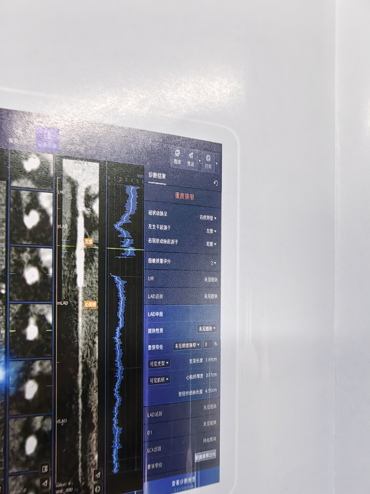
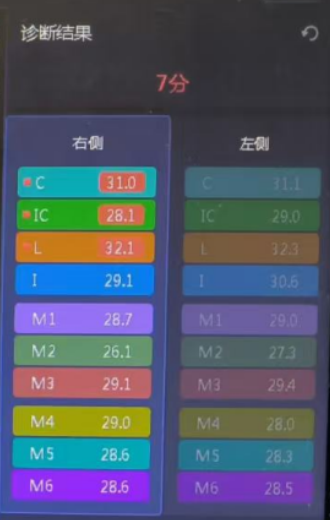

## 诊断结果表单前端全生命流程

载入页面->service对象向后端请求结构化半成品表单（json化的表单配置（计算结果布局，数据合理性约束））转化为配置对象

service对象解析json，分离其中配置构造：

1.结构化存储对象，一切前端修改操作仅仅与它对话，修改操作调用挂载在该对象上的回调函数。

2.表单配置对象，里面包含了多状态表单项的配置参数（是否折叠，高亮）和通过json配置文件生成的状态转换函数

3.表单合法性约束对象，里面包含了通过json配置文件生成的各种表单约束函数

这三个对象有完全相同的嵌套结构，仅仅是其中字段不同，方便同步移动以递归遍历处理事件逻辑。

切换到相应功能模式时，功能模式对应的extension实现从service对象请求（1）结构化存储对象（2）表单配置对象（3）表单合法性约束对象.

之后创建诊断结果表单 ,调用表单库中的表单创建函数，传入同一级别的结构化存储对象和表单配置对象，即可生成对应的表单，表单布局的结构应与配置对象的结构一致

i.e <customizesheet data= reportSheetData config=reportSheetconfig/>

当用户完成表单提交后，调用表单库中的表单效应函数，传入同一级别的结构化存储对象和表单合法性约束对象，即可校验对应的诊断结果表单，表单布局的结构应与配置对象的结构一致。

若未通过校验，弹窗提示用户什么表单项有误。

若通过校验，向后端回传结构化存储对象对应的json文件

注意：第一步后端生成json时避免一步生成三个对象合并的报文，至少保证结构化存储对象的

生成/处理函数相对独立，便于前后端对接以及后续生成对应的诊断报告。

后端收到后生成对应的初步诊断报告入数据库，前端通过抓取按钮从后端获取pdf文件。

灌注参数图分析及梗死区病灶分析

主要表单组件可以复用上述诊断结果表单的表单库

aspect评分及交互部分杂项

由后端传送的json文件得到灌注体积，区域名称和具体得分

监听鼠标移动到某区域高亮边缘，单击某区域高亮

